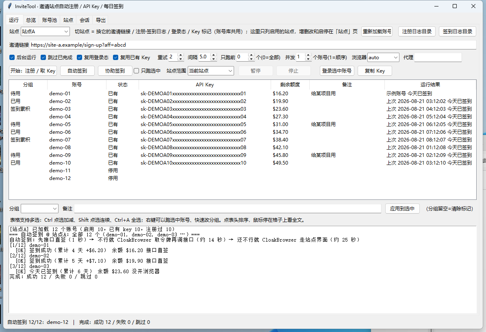
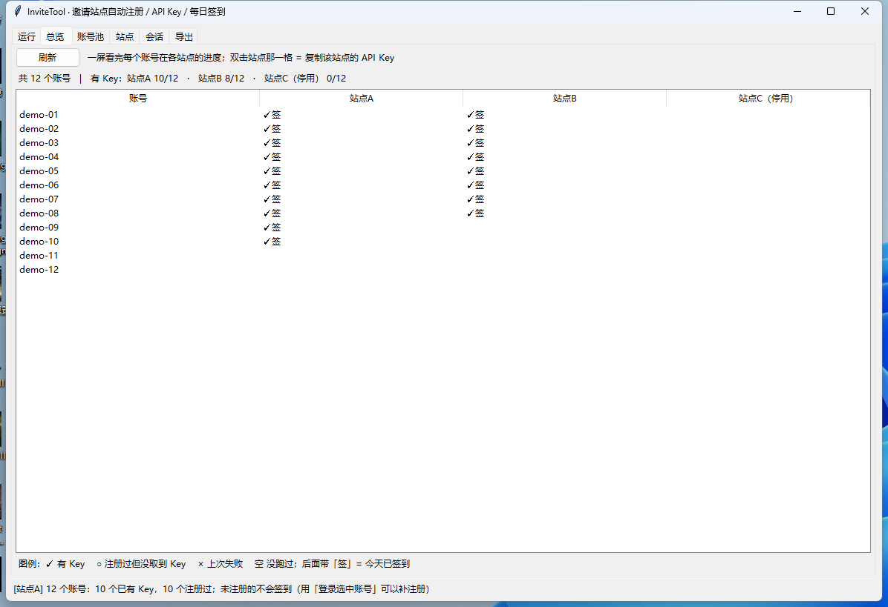
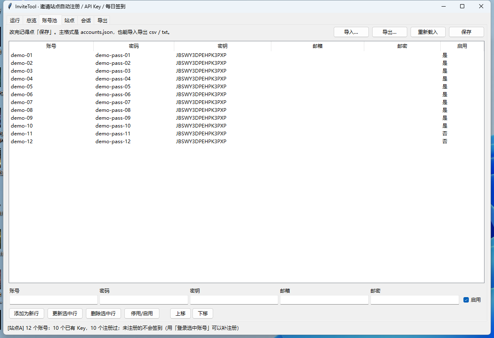
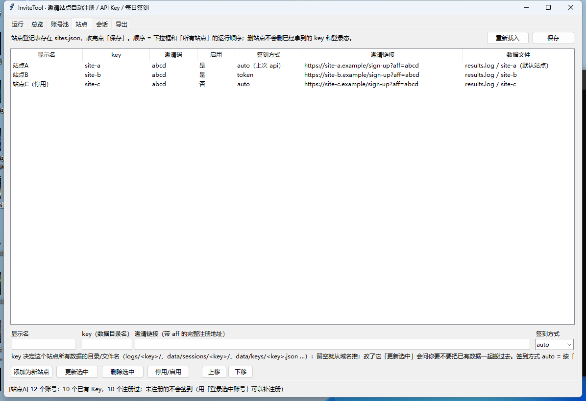
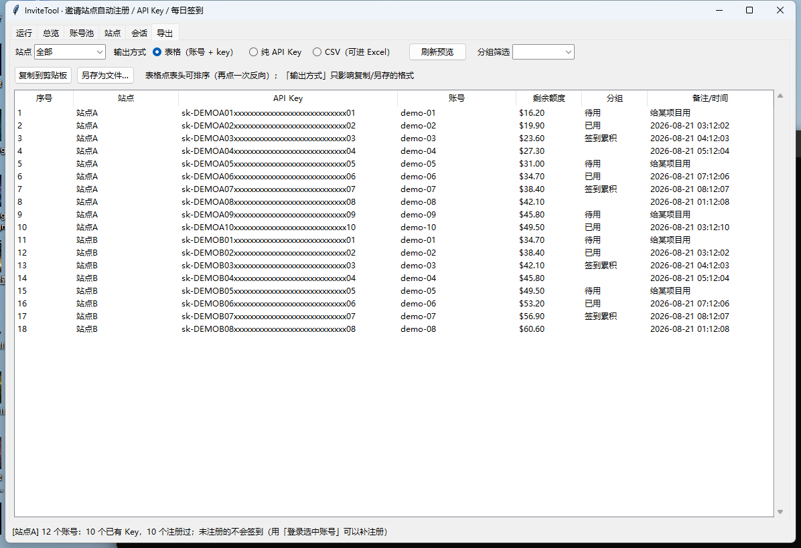

# InviteTool

Windows 桌面小工具：拿**你自己的**一批 GitHub 账号，在多个**同构的 new-api 中转站**上自动完成
「走邀请链接注册 → 生成 API Key → 每天签到领额度」，并把 key 集中管起来、导出成表格。

纯 Python 标准库 + Playwright，**没有服务端、没有数据库、没有账号上云**——数据全在程序目录下的
`data/` `logs/` `exports/` 三个文件夹里，界面是 Tkinter。

> ⚠️ **先说清楚**
> - 只用来管理**你自己拥有的**账号，遵守目标站点的服务条款；别拿它薅不属于你的东西
> - `data/` 里是**明文**的 GitHub 密码、TOTP 密钥、API Key、会话 cookie。仓库已经用
>   `.gitignore` 把它们排除，**不要**提交、不要外发、不要放网盘
> - 同一个 IP 批量注册/签到有被站点或 GitHub 风控的风险，工具默认串行 + 有间隔，别贪快



*「运行」页：一批账号 × 当前站点，状态 / API Key / 剩余额度 / 分组一屏看完，下面是实时日志。
本文截图均为演示用的假数据。*

---

## 它能干什么

| 能力 | 说明 |
| --- | --- |
| **批量注册 + 取 Key** | 走邀请链接 → GitHub OAuth（账号密码 + 本地算 2FA）→ 授权 → 建令牌 → 取回完整 key |
| **每日签到（全自动）** | 三种方式自动试探并记住最优：接口直签 → 反检测浏览器取人机验证令牌 → 走站点界面 |
| **协助签到** | 极端情况下开一个可见窗口，工具先自己试，不成才等你点一下，签上自动关窗进下一个 |
| **多站点** | 站点表在界面里增删改；一次可以跑当前站点 / 所有启用站点 / 自选几个（顺序执行） |
| **并发** | 1~8 个账号同时跑（签到实测 6 并发 11.6 秒跑完 6 个，顺序要 66 秒） |
| **断点续跑** | 已成功 / 今天已签的自动跳过，重跑同一条命令就是继续 |
| **Key 管理** | 按站点存 key + 剩余额度，支持分组/备注标记，导出表格 / 纯 key / CSV |
| **登录态复用** | 保存 `storage_state`，下次不用再走 GitHub；可整包导出换机器 |
| **随时停止** | 点「停止」1 秒内中断正在跑的账号并关掉浏览器，那个账号记 skip、下次接着做 |

---

## 支持一下作者 🙏

工具本身不带任何站点，**得你自己先有一个站点账号**才拿得到邀请链接。如果你还没有，
用下面我的链接注册就是对这个项目最好的支持——你我都能多拿一点 AI Token 额度，下面的站点加起来有 500 多刀额度，我也更有动力继续维护：

| 站点 | 邀请链接 |
| --- | --- |
| agentrouter | https://agentrouter.org/register?aff=y6y7 |
| tabitoken | https://tabitoken.com/sign-up?aff=QnZ3 |
| gorouter | https://gorouter.app/sign-up?aff=5FrO |
| justwoker | https://api.justwoker.icu/sign-up?aff=prV1 |
| seekai | https://seekai.cc/sign-up?aff=n2KE |

注册完，到站点里复制**你自己的**邀请链接填进「站点」页（**保留 `aff=` 参数**），
工具就会用它注册并自动带上邀请关系——也就是下面「快速开始」的第 1 步。
觉得有用也欢迎给个 Star。

> 站点是第三方运营的，随时可能改版、限流或关站，能不能用、给多少额度都由站点决定，
> 这个仓库只提供自动化工具，不为站点本身背书。

---

## 快速开始

需要 Windows + Python 3.10 以上（3.13 / 3.14 也行）+ 本机装了 Chrome 或 Edge。

```powershell
git clone <你的仓库地址> invite && cd invite
pip install -r requirements.txt      # playwright + cloakbrowser
python -m cloakbrowser install       # 签到要用的反检测 Chromium（约 562MB，只下一次）
python gui.py                        # 打开界面
```

双击也行：`scripts\启动.cmd`（第一次会自己装依赖）。另外三个双击入口：
`自动签到.cmd`、`协助签到.cmd`、`导出Key.cmd`。反检测浏览器不装也能跑，只是签到只剩「接口直签」
一种方式，站点开着人机验证就签不上。

**第一次要做两件事**（程序自带的是空表，不内置任何站点和账号）：

1. 「站点」页 → 填显示名 + **你的邀请链接**（带 `aff=` 的完整注册地址）→「添加为新站点」→「保存」
2. 「账号池」页 → 导入账号库，每行三样：GitHub 账号、密码、TOTP 密钥。json / csv / txt 都认，
   json 长这样：`{"version": 1, "accounts": [{"username": …, "password": …, "totp_secret": …}]}`
   （TOTP 密钥就是给验证器 App 扫的那串 base32，工具本地按 RFC 6238 算 6 位码，不联网）

然后回「运行」页：`开始：注册 / 取 Key` → 跑完在表格里看 key；之后每天点一次 `自动签到`
（或者把 `scripts\自动签到.cmd` 挂到 Windows 任务计划程序里）。

### 打包成 exe（可选）

`scripts\构建exe.cmd` → `dist\InviteTool\InviteTool.exe`。双击开界面（无黑窗），带参数就是命令行。
**包里不含任何数据**，换机器第一次运行会自己建空的 `data/accounts.json` 和 `data/sites.json`。

---

## 界面

六个页签，都在一个窗口里：

| 页签 | 干什么 |
| --- | --- |
| **运行** | 选站点、跑注册/签到、看每个账号的状态和 key。表格点表头排序、鼠标停在格子上看全文；分组在第一列 |
| **总览** | 「账号 × 站点」矩阵，一眼看出谁在哪个站点还没注册 / 没签到 |
| **账号池** | 账号库的增删改查、导入导出（json / csv / txt 互转）、停用某个账号 |
| **站点** | 站点登记表：显示名 / key（数据目录名）/ 邀请链接 / 签到方式，可停用、排序 |
| **会话** | 每个账号的登录态：保存时间、uid、最近签到；可整包导出导入换机器 |
| **导出** | 表格形式列出所有 key（可按站点/分组筛选、点表头排序），复制到剪贴板或另存 |

<table>
<tr>
<td width="50%"><br>
<sub><b>总览</b>：<code>✓</code> 有 Key、<code>○</code> 没取到 Key、<code>×</code> 上次失败、空白 = 没跑过，后面带「签」= 今天已签到；双击一格复制那个站点的 key</sub></td>
<td width="50%"><br>
<sub><b>账号池</b>：账号库就地编辑，改完点「保存」；停用的账号批量跑时会跳过</sub></td>
</tr>
<tr>
<td width="50%"><br>
<sub><b>站点</b>：<code>auto（上次 api）</code> 是它自己记住的最优签到方式；表格顺序 = 「所有站点」的运行顺序</sub></td>
<td width="50%"><br>
<sub><b>导出</b>：三种输出方式只影响复制/另存的格式，预览表格始终是这一张</sub></td>
</tr>
</table>

运行页那排开关：后台运行（窗口挪到屏幕外）、跳过已完成、复用登录态、复用已有 Key、重试次数、
账号间隔、只跑前 N 个、**并发**、浏览器 channel、代理；按钮那行还有 **站点范围**
（当前站点 / 所有启用站点 / 自选站点）。

## 命令行

```powershell
python cli.py                                   # 默认站点：注册 / 取 Key
python cli.py --checkin                         # 自动签到（--site 可给 key / all / 逗号分隔的几个）
python cli.py --checkin --concurrency 4         # 同时跑 4 个账号（1=顺序，上限 8）
python cli.py --checkin --checkin-method ui     # 强制某种签到方式：api / token / ui
python cli.py --checkin-assist                  # 协助签到（可见窗口）
python cli.py --open <账号>                     # 打开一个已登录窗口（手工补注册/看页面）
python cli.py --sites                           # 站点表 + 每站进度 + 签到方式
python cli.py --export table --all-sites        # 导出所有站点的 key
python cli.py --check                           # 体检账号库（格式 / 重复 / TOTP 能不能算码）
python cli.py --mint-tokens                     # 给账号生成站点访问令牌（长期凭据）
python cli.py --sync-quota                      # 刷新每个账号的剩余额度（走接口）
```

`--limit N` / `--only a,b` / `--start N` / `--rerun-done` / `--retries N` / `--delay 秒` /
`--proxy http://…` 都支持，`python cli.py -h` 有完整清单。

---

## 原理

这些中转站后端都是 **new-api**（开源的 API 网关），前端各家自研但接口一致，所以一套流程能通吃。

### 注册取 Key（用本机 Chrome，有头）

```
邀请链接 → 把 aff 写进 localStorage → 等 Cloudflare 拦截页放行
        → 勾「我已阅读并同意」（有的话）→ 点「使用 GitHub 继续」
        → GitHub 账号密码 + 本地算的 2FA → 首次授权 Authorize
        → 回站点确认登录 → 存登录态 → 建令牌取 key → 写 data/keys/<站点>.json + 日志
```

取完整 key 要**三步**（这是 new-api 的设计）：`POST /api/token/` 建（响应里没有 key）→
`GET /api/token/?p=1&size=100` 列表（key 是打码的）→ `POST /api/token/{id}/key` 取裸 key。
key 固定要求：永不过期 + 无限配额 + 有分组；已经有合格的就复用不新建。

### 每日签到（用反检测 Chromium，无头）

`POST /api/user/checkin` 必须带 Cloudflare Turnstile 令牌。工具按下面顺序试，**哪种成了就记进
`data/sites.json`，下次这个站点直接从那种开始**（`checkin_method` / `last_ok_method`）：

| 方式 | 怎么干 | 耗时 |
| --- | --- | --- |
| `api` | 直接打接口 | 约 1 秒，站点没开人机验证时够用 |
| `token` | 在**站点域名下的空白承载页**上自己渲一个验证组件、点一下拿到令牌，再**在那个页面里** `fetch` 提交签到 | 约 14 秒，不碰站点 UI，改版也不影响 |
| `ui` | 灌登录态 → 过拦截页 → 头像 → 个人资料 → 立即签到 → 弹验证就自动勾 | 约 25 秒，兜底 |

判据一律是"回查 `GET /api/user/checkin` 说今天签过了"，不看页面文案。

### 鉴权有三套，工具都认

1. `POST /api/user/auth/refresh` 换 `access_token` 走 `Authorization: Bearer`（较老的版本有）
2. 没有那个接口的版本：session cookie + `New-Api-User: <uid>` 头
3. **系统访问令牌**（`GET /api/user/token`）：带 `Authorization: <令牌>` + `New-Api-User`，
   长期有效、免 cookie，所以查签到状态 / 列取 key 都不用开浏览器。
   ⚠ 那个接口是**重新生成**，调一次旧的立刻作废，所以只在没存过时调

---

## 特别解决的几个难题

这些都是实测踩出来的，是这个项目真正的价值所在。

### 1. Cloudflare Turnstile：换浏览器内核才有解

**普通 Chromium 无论怎么伪装都拿不到那个令牌。** 试过并确认无效的：注入 `api.js` 自己 `render()`、
同源空白页渲染、关掉全部指纹伪装、`playwright-stealth`、可见窗口 + 真人手点、把组件搬到本地页面、
带 `cf_clearance` 直接打接口……现象一致：widget 能挂上，但 60 秒不出令牌、连 `error-callback`
都不触发。

**结论**：卡的不是"点击是模拟的"，而是**浏览器构建本身被识别**。换成
[CloakBrowser](https://github.com/CloakHQ/CloakBrowser)（源码级打过补丁的 Chromium，
Playwright 照常驱动）就能正常签发令牌，无头也行。另外两条验证过但已删掉的路：裸起 Chrome + 手写
CDP「点完立刻断开连接」能过，但要灌 Chrome 配置目录、慢一倍；Camoufox（补丁版 Firefox）也能过，
但启动慢 7 秒。

### 2. 令牌必须"在浏览器页面里"提交

拿到令牌用 Python 去 POST，某些站点会回「Turnstile 校验失败」。原因是 new-api 校验时把
`remoteip` 一起交给 siteverify，而令牌是浏览器那条连接解出来的，Python 的出口 IP 不一定相同
（IPv6/IPv4 优先级不同就够了）。所以工具在**承载页里** `fetch` 提交，天然同一个出口。

### 3. 拦截页 ≠ 人机验证

**托管拦截页**（整页「请稍候…」）看的是有没有头：真实有头 Chrome 去掉自动化特征位就能过，无头卡死。
**Turnstile**（页内小组件）跟有没有头无关，只看内核可不可信（CloakBrowser 无头 3.7 秒就过了拦截页
进 dashboard）。所以上面那个"注册有头 / 签到无头"的分工不是随便定的。顺带解决了"有头就占屏幕"：
后台模式还是同一个有头浏览器，只是窗口挪到 `-32000,-32000`，再把 JS 里的 `screenX/screenY`
修正回正常值。

### 4. 并发：每条线程一个 Playwright 实例

Playwright 的 sync API **不能跨线程共用**（同线程也不能嵌套第二个实例，会报
*Sync API inside the asyncio loop*）。所以并发是"一个待办队列 + N 条线程，每条线程自己
`sync_playwright()`"，结果落盘/回调/计数都在锁里，日志行前面加 `[账号]` 区分。
签到实测 6 并发 6/6 成功、11.6 秒（顺序 66 秒），每个浏览器约 500MB 内存，所以上限写死 8。

> 其它踩坑记录（点复选框的时序、同意条款把按钮变 disabled、一次性 refresh cookie、
> 暂时性失败当场重试、停止怎么做到即时、Windows 的 GBK/打包坑…）都写在对应模块的注释里，
> 改代码前建议先扫一眼那几个文件开头的说明。

---

## 数据放在哪

```
data/
  accounts.json              账号库（所有站点共用；明文密码 + TOTP 密钥）
  sites.json                 站点登记表（含你的邀请链接、签到方式）
  keys/<站点>.json            拿到的 API Key + 剩余额度（正式数据）
  keys-meta/<站点>.json       你给 key 标的分组 / 备注
  tokens/<站点>.json          站点访问令牌（长期凭据）
  sessions/<站点>/            登录态：<账号>.json + index.json（uid、最近签到）
logs/<站点>/
  results.log  checkin.log  password.log      制表符分隔的流水账
  shots/                     失败时的整页截图
exports/                     导出的 key（表格 / 纯 key / CSV）
```

站点的 `key` 从域名推（也可以在界面里手改，改了会把上面 5 处数据一起搬过去）。
所有路径都从 `paths.py` / `Site` 的方法取，打包成 exe 后自动指向 exe 同级目录。

**这些全是明文敏感数据**，`.gitignore` 已经排除；要备份就整个 `data/` 一起拷，别单拷一半。

## 项目结构

| 分层 | 文件 |
| --- | --- |
| 入口 | `gui.py` Tkinter 六页签（控件只在轮询回调里改）、`cli.py` 参数 → `Settings` + 决定跑哪些站点 |
| 流程本体 | `runner.py` 浏览器启动、GitHub 登录、取 key、签到方式编排、批量与并发编排 |
| 反检测 | `cloaksolve.py` CloakBrowser 层（起浏览器、灌登录态、点 Cloudflare 复选框、承载页取令牌）、`cloakui.py` 走站点界面（签到方式 `ui` + 协助签到）、`fingerprint.py` 本机 Chrome 那条路的设备指纹 |
| 接口 | `httpapi.py` 不开浏览器查状态/直签、`tokenstore.py` 站点访问令牌、`totp_util.py` 本地算 2FA |
| 数据 | `sites.py` 站点表 + 所有数据路径的唯一来源 + 签到方式记忆、`store.py` / `session.py` 账号库 / 登录态、`keystore.py` / `keymeta.py` key 正式表 / 人工标记、`export.py` 导出 |
| 杂项 | `paths.py` 目录规划 + 老布局迁移 + 首次运行建空数据、`make_launchers.py` 生成 `scripts/`（.cmd 必须 GBK）、`tools/probe*.py` 站点改版时探页面结构 |

---

## 常见问题

| 现象 | 怎么办 |
| --- | --- |
| `Turnstile token 为空` | 这次用的是接口直签而站点开着验证；让它往下试，或确认 `python -m cloakbrowser info` 里 `installed=True` |
| `没拿到 Turnstile 令牌（api.js load failed）` | 网络抽风，会自动重开页面 + 整个账号按 `--retries` 重试；连着几个都这样就挂代理 |
| `站点要求先勾「我已阅读并同意」，工具没能勾上` | 站点改了勾选框结构，`python tools/probe_terms.py <站点>` 看现状，把选择器加到 `runner.AGREE_CLICK` |
| `GitHub 账号被 flag，不能授权第三方应用` | GitHub 风控，只能人工申诉；工具已判死不重试，建议把这个号停用 |
| `Cloudflare 拦截页没过去`（注册） | 注册那条路必须有头，别改成无头；换代理或过一会儿再跑 |
| 双击 exe 没反应 | 看 exe 旁边的 `error.log`（窗口模式没有控制台） |
| 站点改版了 | `python tools/probe.py <URL>` 看真实结构，把新选择器**加到 `runner.py` 顶部的候选表**里，不用改流程代码 |
